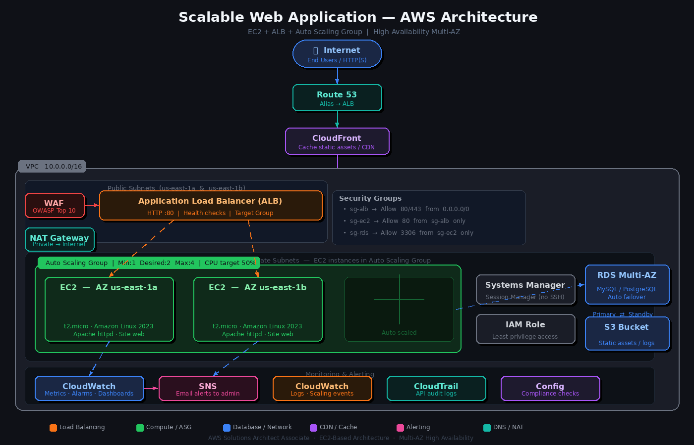

# Scalable Web Application with ALB and Auto Scaling

## Project Overview
This project demonstrates how to deploy a **production-grade, highly available, and scalable web application** on AWS using EC2 instances inside a properly architected VPC with public and private subnets across two Availability Zones.

The solution achieves high availability and scalability with an **Application Load Balancer (ALB)**, **Auto Scaling Group (ASG)**, and a **CloudFront** distribution for caching static assets. A **Multi-AZ RDS** instance serves as the database backend, with all compute resources placed in private subnets.

---

## Solution Architecture Diagram



---

## Architecture Explanation

### 🔹 User Access & DNS
- End-users access the application via a custom domain managed by **Route 53**.
- Route 53 uses an **Alias record** pointing to the ALB, with **health checks** to ensure availability.
- Requests first pass through **CloudFront**, which caches static assets at edge locations to reduce latency worldwide.

### 🔹 Network — VPC Design
- A custom **VPC (10.0.0.0/16)** is created with:
  - **2 Public Subnets** (us-east-1a, us-east-1b) — host the ALB and NAT Gateway.
  - **2 Private Subnets** (us-east-1a, us-east-1b) — host EC2 instances and RDS.
- An **Internet Gateway** is attached for public subnet internet access.
- A **NAT Gateway** in the public subnet allows private EC2 instances to reach the internet (for updates) without being publicly exposed.
- **Route Tables** are configured separately for public and private subnets.
- **Network ACLs (NACLs)** provide a stateless layer of traffic filtering at the subnet level.

### 🔹 Load Balancing — ALB + WAF
- The **Application Load Balancer (ALB)** operates at Layer 7 and:
  - Distributes incoming HTTP/HTTPS traffic across EC2 instances in both AZs.
  - Uses **listener rules** to route requests to the correct Target Group.
  - Performs **health checks** and routes traffic only to healthy instances.
- **AWS WAF** is attached to the ALB with managed rule groups covering the **OWASP Top 10** vulnerabilities (SQL injection, XSS, etc.).

### 🔹 Compute — EC2 + Auto Scaling Group
- EC2 instances are launched using a **Launch Template** that defines:
  - AMI (Amazon Linux 2023), instance type (t2.micro), Security Group, IAM Role, and User Data script to install and start the web server.
- The **Auto Scaling Group (ASG)** spans both private subnets across 2 AZs and:
  - Maintains a minimum of 1, desired of 2, and maximum of 4 instances.
  - Uses **Target Tracking Scaling** to keep average CPU utilization at 50%.
  - Uses **Step Scaling** to add/remove instances based on CloudWatch alarms.

### 🔹 Database — RDS Multi-AZ
- A **Multi-AZ RDS instance** (MySQL/PostgreSQL) is deployed in the private subnets.
- RDS automatically provisions a **standby replica** in a second AZ.
- In case of failure, RDS performs **automated failover** to the standby with no manual intervention.
- Access is restricted to EC2 instances via Security Group rules (port 3306/5432).

### 🔹 Security
- **Security Groups** act as stateful virtual firewalls:
  - `sg-alb`: Allows HTTP (80) and HTTPS (443) from `0.0.0.0/0`.
  - `sg-ec2`: Allows port 80 only from `sg-alb` — EC2 instances are never directly exposed.
  - `sg-rds`: Allows port 3306/5432 only from `sg-ec2`.
- **IAM Roles** attached to EC2 instances follow the least-privilege principle, granting only the permissions needed (e.g., CloudWatch Logs, SSM).
- **AWS WAF** protects the ALB against common web exploits.
- All compute resources are in **private subnets** — no direct public access.

### 🔹 Secure Access — Systems Manager
- **AWS Systems Manager Session Manager** is used for secure shell access to EC2 instances.
- This eliminates the need for a Bastion Host and removes the requirement to open port 22 (SSH).
- Access is fully audited through CloudTrail.

### 🔹 Monitoring & Alerts
- **Amazon CloudWatch** collects:
  - Metrics: CPU utilization, network I/O, request counts.
  - Logs: Application logs from EC2 instances via the CloudWatch Agent.
  - Dashboards: Real-time visual overview of system health.
  - Alarms: Trigger scaling actions and SNS notifications.
- **Amazon SNS** sends email/SMS notifications to administrators when:
  - CPU exceeds 70% for more than 2 minutes.
  - An instance becomes unhealthy.
  - ASG scaling events occur.

---

## Key AWS Services Used

| Service | Role |
|---|---|
| **VPC** | Isolated network with public/private subnets, NAT Gateway, NACLs |
| **EC2 + ASG** | Scalable compute with Launch Template and target tracking policies |
| **ALB** | Layer 7 load balancing, listener rules, health checks |
| **AWS WAF** | Web application firewall — OWASP Top 10 protection |
| **CloudFront** | CDN — caches static assets, reduces latency globally |
| **RDS Multi-AZ** | Managed relational database with automated failover |
| **Route 53** | DNS management — Alias record pointing to ALB |
| **Systems Manager** | Session Manager for bastion-free secure EC2 access |
| **CloudWatch** | Metrics, logs, dashboards, and alarms |
| **SNS** | Alert notifications to administrators |
| **IAM** | Roles and policies for least-privilege access |
| **Security Groups** | Stateful firewall rules for EC2, ALB, and RDS |

---

## How It Works — Step by Step

1. A user sends an HTTP/HTTPS request to the domain.
2. **Route 53** resolves the domain and routes traffic to **CloudFront**.
3. **CloudFront** serves cached static assets from edge locations. Dynamic requests are forwarded to the **ALB**.
4. **AWS WAF** inspects the request against OWASP Top 10 rules before it reaches the ALB.
5. The **ALB** checks its Target Group health and forwards the request to a healthy **EC2 instance** in a private subnet.
6. The EC2 instance processes the request, querying the **RDS Multi-AZ** database if needed.
7. The **ASG** monitors CloudWatch metrics and automatically adds or removes EC2 instances based on load.
8. **CloudWatch** continuously monitors metrics and logs. If a threshold is breached, it triggers an **SNS** notification to the admin.
9. Engineers access EC2 instances securely via **Systems Manager Session Manager** — no SSH or bastion host required.

---

## Learning Outcomes Achieved

- ✅ Designed a VPC with correct subnet, route table, and NAT Gateway configurations.
- ✅ Built a highly available architecture across multiple Availability Zones.
- ✅ Configured ALB listener rules and target group health checks.
- ✅ Implemented Auto Scaling with target tracking and step scaling policies.
- ✅ Secured the application with WAF, Security Groups, NACLs, and private subnets.
- ✅ Used Systems Manager Session Manager as a bastion-free access alternative.
- ✅ Set up CloudWatch dashboards, alarms, and SNS notifications for full observability.
- ✅ Deployed a Multi-AZ RDS instance with automated failover for database resilience.

---

## Project Structure

```
AWS2-SAA-project-main/
├── index.html                 # Web application front-end
├── main.js                    # Client-side JavaScript
├── architecture-diagram.png   # Solution architecture diagram
├── README.md                  # Project documentation
├── CSS/
│   ├── style.css              # Main stylesheet
│   ├── mobile.css             # Mobile responsive styles
│   └── widescreen.css         # Widescreen styles
└── img/                       # Static assets
```
